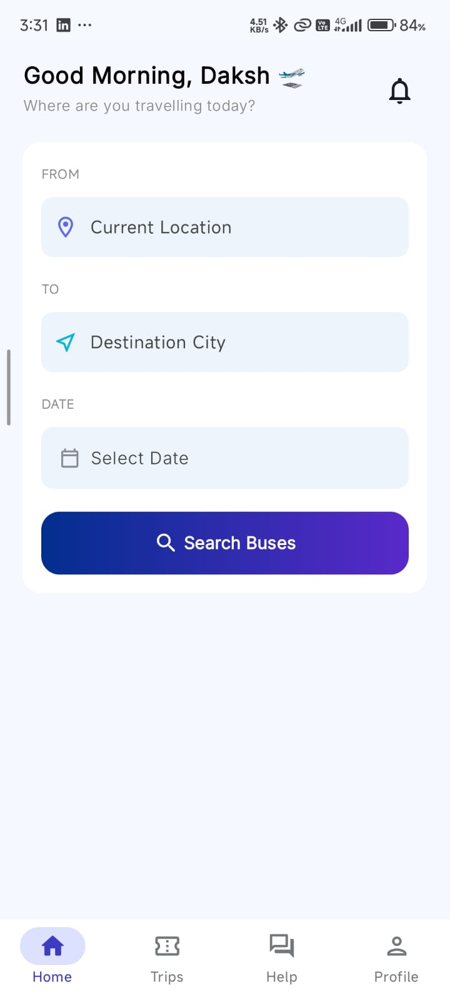
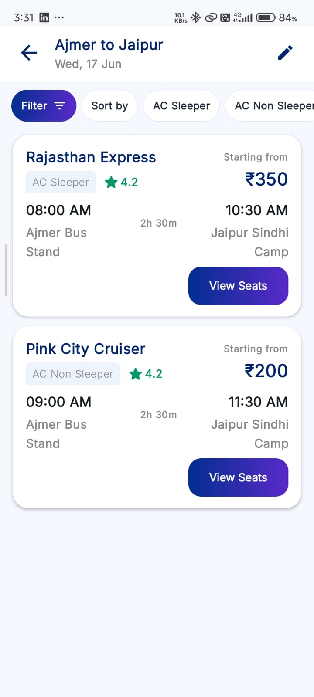
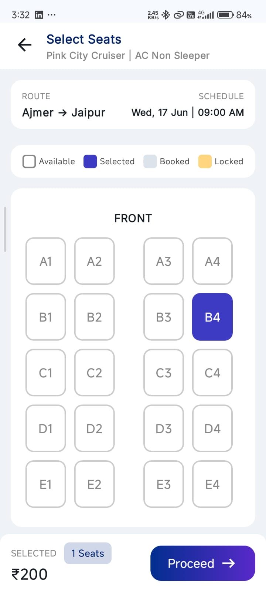
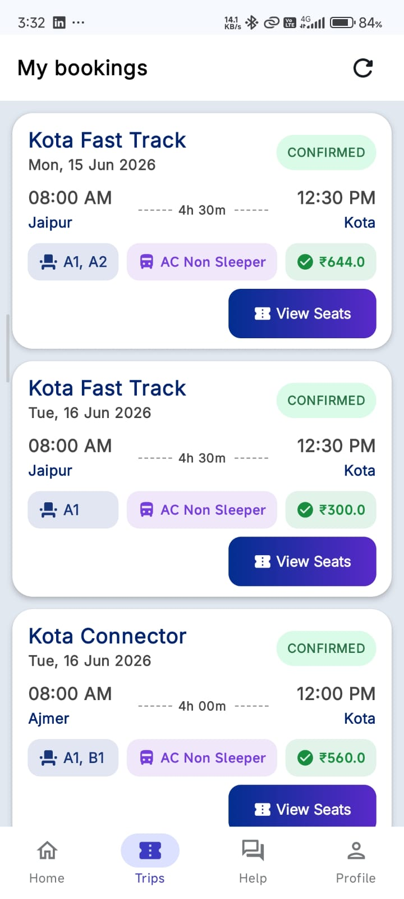
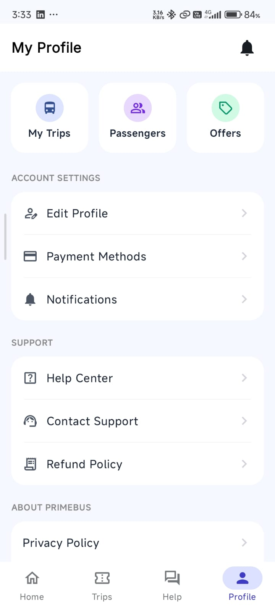
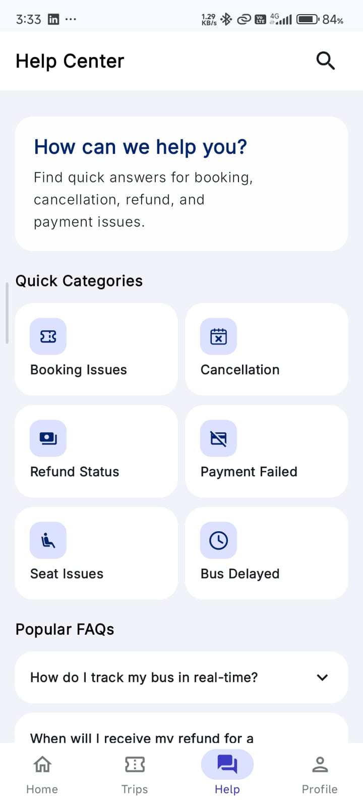

# 🚌 PrimeBus - Modern Bus Booking Android Application

PrimeBus is a modern Android bus booking application built using **Kotlin**, **Jetpack Compose**, **MVVM Architecture**, **Firebase**, **Room Database**, and **Hilt Dependency Injection**.

The application provides a bus reservation experience with real-time seat locking, booking history, Razorpay payment integration, and a Material 3 user interface. It's an actively developed portfolio project — see [Project Status](#-project-status) below for what's complete versus in progress.


---

# ✨ Features

## 🔐 Authentication

* Phone number OTP verification
* Google Sign-In via Credential Manager API
* Persistent user sessions

## 🏠 Home Screen

* Material 3 UI built with Jetpack Compose
* City-to-city route search with autocomplete
* Journey date picker

## 🔍 Bus Search

* Search buses by route and date
* Dynamic bus listing filtered by selected route

## 💺 Real-Time Seat Selection

* Dynamic seat layout rendered from a Firebase-defined template per bus type
* Real-time visibility of seats locked by other users
* Firebase Transaction-based seat locking
* Double-booking prevention
* Auto-expiring locks (5-minute hold) if checkout isn't completed

## 👥 Passenger Details

* Per-seat passenger information form
* Input validation
* Contact details capture (phone, email)

## 💳 Booking Flow

* Booking summary and fare calculation
* Razorpay checkout integration (currently configured in **test mode**)
* Payment success/failure callback handling
* Booking confirmation screen

## 🎫 Ticket Management

* Booking history synced from Firebase
* Ticket detail view per booking
* PDF ticket generation
* Download tickets to device storage

## 📡 Offline Support

* Room Database caching
* Offline-first data loading
* Pull-to-refresh synchronization
* Internet connectivity monitoring
* Automatic cache fallback

## 🆘 Help Center

* Frequently Asked Questions with expandable sections
* Support categories and contact options

---

# 🏗 Architecture

PrimeBus follows the **MVVM (Model-View-ViewModel)** architecture pattern combined with the **Repository Pattern** for scalability, maintainability, and separation of concerns.

```text
Presentation Layer
│
├── Jetpack Compose Screens
├── Reusable Components
├── Navigation (graph-scoped shared ViewModels)
└── ViewModels (expose sealed UiState via StateFlow)

Data Layer
│
├── Repository (single source of truth per domain)
├── Firebase Realtime Database
├── Firebase Authentication
└── Room Database (local cache)
```

### Architecture Components

* MVVM Architecture
* Repository Pattern
* Hilt Dependency Injection
* Kotlin Coroutines
* StateFlow
* Graph-scoped shared ViewModel (via Navigation Compose `sharedViewModel`)
* Sealed `UiState` classes for ViewModel → UI communication

---

# 🔄 Data Flow

```text
UI (Compose)
 ↓ collectAsStateWithLifecycle
ViewModel (StateFlow<UiState>)
 ↓ suspend / Flow
Repository
 ↓
Firebase Realtime Database  ←→  Room Cache (fallback)
```

### Seat Booking Flow

```text
User taps seat
       ↓
Firebase Transaction (atomic check-and-lock)
       ↓
Seat locked (5-min expiry, visible to other users in real time)
       ↓
Checkout completed → Booking written + lock released
       ↓
Booking synced to Room cache
       ↓
UI updated via StateFlow
```

---

# 🛠 Tech Stack

| Category             | Technology                 |
| -------------------- | -------------------------- |
| Language             | Kotlin                     |
| UI Toolkit           | Jetpack Compose            |
| Design System        | Material 3                 |
| Architecture         | MVVM                       |
| Dependency Injection | Hilt                       |
| Local Database       | Room                       |
| Backend Database     | Firebase Realtime Database |
| Authentication       | Firebase Authentication (Google Sign-In) |
| Payments             | Razorpay SDK (test mode)   |
| Concurrency          | Kotlin Coroutines          |
| State Management     | StateFlow                  |
| Navigation           | Navigation Compose         |
| Connectivity         | `ConnectivityManager`-based network monitor |

---

# 📂 Project Structure

```text
com.example.primebus
│
├── core
│   ├── di              # Hilt modules (Auth, Firebase, Database, Network) + qualifiers
│   ├── navigation       # NavGraph, NavRoutes, RootNavGraph, BottomNavigationBar
│   └── utils            # sharedViewModel extension, Constants
│
├── data
│   ├── models           # Booking, Bus, SeatModel, UserModel, TripRequest, etc.
│   └── repository       # AuthRepository, BookingRepository, BusRepository,
│                         # SeatRepository, ProfileRepository
│
├── features
│   ├── auth              # LoginScreen, OTPScreen, AuthViewModel, OTP provider
│   ├── home               # HomeScreen, BusScreen, BusSeatScreen + ViewModels
│   ├── booking             # CheckoutScreen, BookingSuccessScreen, BookedTripsScreen
│   ├── profile             # ProfileScreen, EditProfile, Help Center, policy screens
│   ├── payment             # RazorpayManager
│   └── room                # AppDatabase, BookingDao, TypeConverters
│
└── MainActivity.kt        # Hosts Razorpay PaymentResultListener bridge
```

---

# ⚡ Technical Highlights

* Built entirely using Jetpack Compose with Material 3
* MVVM Architecture with Repository Pattern as the single source of truth
* Hilt Dependency Injection across DI modules with custom qualifiers
* Real-time seat locking using Firebase Transactions, with auto-expiring holds
* Double-booking prevention via atomic transaction checks
* Room-based local caching for bookings and bus data
* Sealed `UiState` classes (`Loading` / `Success` / `Error`) instead of callback-based ViewModel APIs
* `callbackFlow` for all Firebase real-time listeners, with `awaitClose` to guarantee listener cleanup
* Graph-scoped shared ViewModel pattern for multi-screen flows (seat selection → checkout)
* Connectivity-aware UI via a `Flow<Boolean>` network monitor
* Razorpay payment SDK integration with Activity-bridged result callbacks

---

## 📸 Application Screenshots

<table>
<tr>
<td></td>
<td></td>
<td></td>
</tr>

<tr>
<td align="center"><b>Home</b></td>
<td align="center"><b>Bus Search</b></td>
<td align="center"><b>Seat Selection</b></td>
</tr>

<tr>
<td></td>
<td></td>
<td></td>
</tr>

<tr>
<td align="center"><b>My Trips</b></td>
<td align="center"><b>Profile</b></td>
<td align="center"><b>Help Center</b></td>
</tr>
</table>

---

# 🚀 Getting Started

## Prerequisites

* Android Studio (latest stable)
* JDK 17+
* A Firebase project with Realtime Database and Authentication enabled
* A Razorpay account (test key is sufficient for local development)

## Installation

### 1. Clone Repository

```bash
git clone https://github.com/yourusername/PrimeBus.git
```

### 2. Open in Android Studio

Open the project using Android Studio.

### 3. Configure Firebase

Add your `google-services.json` file inside:

```text
app/google-services.json
```

### 4. Configure Razorpay key

Add your Razorpay test key to `local.properties` (this file should **not** be committed):

```properties
RAZORPAY_KEY=rzp_test_your_key_here
```

Reference it via a `buildConfigField` in `build.gradle.kts` rather than hardcoding it in source — keeping secrets out of version control is a basic but important practice for any production-bound codebase.

### 5. Sync Gradle

Allow Android Studio to download all required dependencies.

### 6. Run Application

Build and run the application on an emulator or physical device (min SDK 24).

---

# 🔮 Future Enhancements

* Online Payment Gateway Integration
* Ticket Cancellation & Refund System
* Push Notifications
* Live Bus Tracking
* Coupon & Offers Module
* Bus Rating & Reviews
* Multi-language Support
* Dark Mode Support
* Advanced Bus Filters

---

# 🎯 What This Project Demonstrates

This project showcases practical Android development skills and modern application architecture, including:

- Building a complete Android application using Jetpack Compose
- Implementing MVVM Architecture with Repository Pattern
- Dependency Injection using Hilt, including custom qualifiers for multiple Firebase references
- State management using StateFlow with sealed UI state classes
- Real-time data synchronization with Firebase Realtime Database
- Firebase Authentication (Google Sign-In) for secure user login
- Real-time seat locking using Firebase Transactions
- Preventing double booking in concurrent user scenarios
- Local caching with Room Database
- Graph-scoped shared ViewModel communication across multiple screens
- Navigation using Navigation Compose
- Connectivity-aware UI and network handling
- Dynamic seat layout rendering driven by remote configuration
- Third-party payment SDK integration (Razorpay) with Activity-bridged callbacks
- Modern Material 3 UI/UX design principles
- Asynchronous programming using Kotlin Coroutines and Flow

---

# 👨‍💻 Developer

**Daksh Singh**

Android Developer | Kotlin | Jetpack Compose | Firebase | UI/UX
